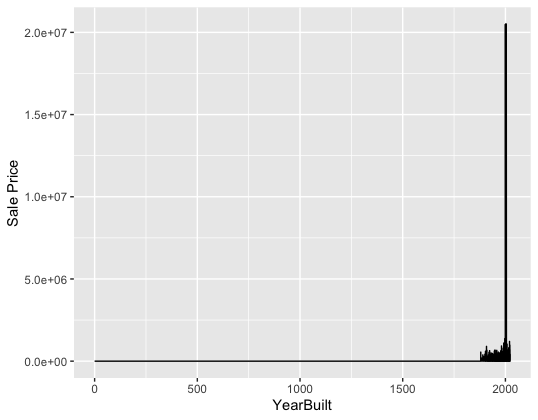

<!-- README.md is generated from README.Rmd. Please edit the README.Rmd file -->

```{r setup, include=FALSE}
knitr::opts_chunk$set(echo = TRUE)
```

# Lab report #1

## Owen Kim

### Data Exploration

Inspecting relationships between year built and sale price<br>

1.  There are various variables related to housing, like

-   Sale Price
-   Total Living Area
-   Year Built
-   Neighborhood
-   Bedrooms
-   Lot Area

2.  I will be inspecting relationships between year built and sale price.

3 & 4.

```         
> range(ames$YearBuilt, na.rm = TRUE)
[1]    0 2022 # there is a dirty data with YearBuilt = 0 messing up the range
```

<br>

```         
> range(ames$`Sale Price`, na.rm = TRUE)
[1]        0 20500000 # also a dirty data
```

<br>

```         
#plot line chart
ggplot(ames, aes(x = `YearBuilt`, y = `Sale Price`)) +
  geom_line()
```



```         
# clean x and plot again
ames_clean <- ames %>%
  filter(`YearBuilt` >= 1880, !is.na(`YearBuilt`), !is.na(`Sale Price`))

ggplot(ames_clean, aes(x = `YearBuilt`, y = `Sale Price`)) +
   geom_point() +
   geom_smooth(method = "loess") +
   labs(title = "Sale Price vs Year Built",
        x = "Year Built",
        y = "Sale Price")
```


```         
# remove y outliers and plot again
Q1 <- quantile(ames_clean$`Sale Price`, 0.25)
Q3 <- quantile(ames_clean$`Sale Price`, 0.75)
IQR <- Q3 - Q1

ames_clean <- ames_clean %>%
  filter(`Sale Price` > (Q1 - 1.5 * IQR) & `Sale Price` < (Q3 + 1.5 * IQR))
  
ggplot(ames_clean, aes(x = `YearBuilt`, y = `Sale Price`)) +
   geom_point() +
   geom_smooth(method = "loess") +
   labs(title = "Sale Price vs Year Built",
        x = "Year Built",
        y = "Sale Price")
```

 <br> Fair to conclude that house price increased over time, and newly built houses are worth more, house price started increasing more rapidly starting 1980.

## Bach Nguyen

### Data Exploration

1.  This dataset appears to include property transaction details, specifically focusing on sales of real estate in Ames.

Parcel ID: Categorical (likely a string or integer). Unique identifier for each property parcel.

Address: String. The physical address of the property. Style: Categorical (string). Describes the architectural style of the building (e.g., "1 Story Frame," "Split Level Frame").

Occupancy: Categorical (string). Describes the occupancy type, such as "Single-Family / Owner Occupied," "Condominium," "Townhouse," etc.

Sale Date: Date. The date when the property was sold (format: YYYY-MM-DD).

Sale Price: Numeric. The price the property was sold for. Some entries have a value of 0, likely indicating no sale or special circumstances.

Multi Sale: Categorical (string, could also be Boolean). Indicates whether the sale was part of a multi-sale transaction (could be "Yes" or "NA").

Year Built: Integer. The year the property was built.

Acres: Numeric. The size of the property in acres.

Total Living Area (sf): Numeric. The total square footage of the living area.

Bedrooms: Integer. The number of bedrooms in the property.

FinishedBsmtArea (sf): Numeric. The square footage of the finished basement area, if applicable.

LotArea (sf): Numeric. The total area of the lot in square feet.

AC: Boolean or Categorical (string). Indicates whether the property has air conditioning (Yes/No).

FirePlace: Boolean or Categorical (string). Indicates whether the property has a fireplace (Yes/No).

Neighborhood: Categorical (string). The name or code of the neighborhood where the property is located.

Expected Data Ranges:

Parcel ID: Likely unique alphanumeric values.

Address: Varies based on location, always string values.

Style: Fixed set of categories describing building types. Occupancy: Limited to a fixed set of categories (e.g., Single-Family, Townhouse).

Sale Date: Should follow a standard date format, possibly ranging across multiple years.

Sale Price: Varies from 0 to several hundred thousand or millions depending on property.

Year Built: Typically ranges from the 1800s to recent years.

Acres: Likely to range from small plots (\<0.1) to several acres.

Total Living Area: Typically ranges from a few hundred square feet to several thousand.

Bedrooms: Likely ranges from 1 to 5 or more.

Finished Basement Area: Can range from 0 to several thousand square feet.

Lot Area: Ranges from a few thousand square feet to tens of thousands.

AC: Yes/No (string or Boolean).

FirePlace: Yes/No (string or Boolean).

Neighborhood: Limited set of neighborhood codes or names.

2.  I am interested in total living area vs sale price.

    3, 4.

    ```{r}
    range(classdata::ames$`TotalLivingArea (sf)`, na.rm = TRUE)
    ```

```{r}
range(classdata::ames$`Sale Price`, na.rm = TRUE)
```

```{r}
library(ggplot2)
ggplot(classdata::ames, aes(x = `TotalLivingArea (sf)`, y = `Sale Price`)) +
   geom_point() +
  geom_line() +
   labs(title = "Sale Price vs Total living area",
        x = "TotalLivingArea (sf)",
        y = "Sale Price")
```

From the plot of Sale Price vs Total Living Area (sf), we see a clear pattern where most sale prices remain clustered at the lower range, despite varying total living areas. There's an odd concentration of extremely high sale prices around the same living area, possibly indicating erroneous or outlier data. It would be useful to investigate these high-priced outliers further to confirm their validity, as they deviate sharply from the rest of the dataset.

## Nhat Le

1.  Therefore, 6935 records with 16 variables. For example:

-   Sale Price
-   Year Built
-   Arcres -Total Living Area
-   Bedriins
-   LotArea

The data types of the variable can be seen by running the below code "str(ames)"

```{r}
ames <- classdata::ames
str(ames)
```

We can see the means and other statistical summaries by running summary(ames)

```{r}
summary(ames)
```

2.  I will be inspecting the Bedrooms and the Sale Price

3 & 4. Sale price ra ranges from 0 to 20500000; Bedrooms ranges from 0 to 10

```{r}
range(ames$`Sale Price`, rm.na = TRUE)
```

```{r}
bedroom_range <- range(ames$Bedrooms, na.rm = TRUE)
print(bedroom_range)
```

The bar chart showing the average sale price by the number of bedrooms indicates how property pricing varies with the number of bedrooms. Typically, you would expect that more bedrooms could correlate with a higher average sale price, although the chart suggests there might be nuances in this relationship.

Review the bar chart for any apparent trends. For example, if properties with one bedroom have significantly higher average sale prices than those with two or three, this might indicate a specific market demand or limited availability of one-bedroom properties.

Look for outliers or unusual data points. If certain bedroom counts have much higher or lower prices than expected, investigate these cases further. For instance, if a property with four bedrooms sells for much less than average, it could be due to other factors like condition, location, or market anomalies.

```{r}
library(dplyr)
library(ggplot2)
# Assuming 'ames' is your dataframe
# First, ensure Bedrooms is numeric and remove NA values
ames$Bedrooms <- as.numeric(as.character(ames$Bedrooms))
ames <- na.omit(ames)

# Create a summarized dataframe to calculate the average Sale Price for each number of Bedrooms
average_price <- ames %>%
  group_by(Bedrooms) %>%
  summarize(Average_Sale_Price = mean(`Sale Price`, na.rm = TRUE))

# Create bar chart
ggplot(average_price, aes(x = factor(Bedrooms), y = Average_Sale_Price)) +
  geom_bar(stat = "identity", fill = "blue", color = "black", alpha = 0.7) +
  labs(title = "Average Sale Price by Number of Bedrooms",
       x = "Number of Bedrooms",
       y = "Average Sale Price") +
  theme_minimal()
```

```{r}
# Assuming 'ames' is your dataframe
# First, ensure Bedrooms is numeric and remove NA values
ames$Bedrooms <- as.numeric(as.character(ames$Bedrooms))
ames <- na.omit(ames)

# Perform ANOVA
anova_result <- aov(`Sale Price` ~ factor(Bedrooms), data = ames)
summary(anova_result)

# Visualize ANOVA results with boxplot
ggplot(ames, aes(x = factor(Bedrooms), y = `Sale Price`)) +
  geom_boxplot(fill = "lightblue", color = "black", alpha = 0.7) +
  labs(title = "Boxplot of Sale Price by Number of Bedrooms",
       x = "Number of Bedrooms",
       y = "Sale Price") +
  theme_minimal()
```

<<<<<<< HEAD
## Tam Minh Nguyen

### Data Exploration

1.  The dataset has 16 variables with 6935 observations. For example, the variable includes:

-   YearBuilt: Year the property was built (numeric variable).
-   Acres: Property size in acres (numeric variable).
-   TotalLivingArea: Total living area in square feet (numeric variable).
-   Bedrooms: Number of bedrooms (numeric variable).
-   FinishedBsmtArea: Finished basement area in square feet (numeric variable).
-   LotArea: Lot size in square feet (numeric variable).

```{r}
str(classdata::ames)
```

2.  I focus on AC(whether it has air conditioner or not) and Sale Price 3 and 4:

```{r}
AC_range <- range(classdata::ames$AC, na.rm = TRUE)
print(AC_range)
```

```{r}
range(classdata::ames$`Sale Price`, na.rm = TRUE)
```

The range of sale prive is from 0 to 20500000

```{r}
library(ggplot2)
ggplot(classdata::ames, aes(x = AC)) +
  geom_bar(fill = "blue", color = "black") +
  labs(title = "Bar Chart of Categorical Variable AC",
       x = "AC",
       y = "Frequency")
```

There is a much higher frequency of properties with air conditioning compared to those without. The significant disparity in frequency suggests that having air conditioning is very common and significantly affects the frequency. There are no unusual patterns directly visible from this chart.

```{r}
library(ggplot2)
avg_sale_price <- classdata::ames %>%
  group_by(AC) %>%
  summarise(avg_price = mean(`Sale Price`, na.rm = TRUE))
ggplot(avg_sale_price, aes(x = AC, y = avg_price, fill = AC)) +
  geom_bar(stat = "identity") +
  labs(title = "Average Sale Price by Air Conditioning",
       x = "Air Conditioning (AC)",
       y = "Average Sale Price")
```

The bar chart shows a clear pattern where the properties with air conditioning have a significantly higher average sale price compared to those without air conditioning. This variable shows a clear difference in sale prices, suggesting that air conditioning is an important feature that strongly affects property value. Moreover, there are no specific oddities apparent from the data. People should look into why there is the big difference in sale price to understand what consumers want and market trends.

=======
>>>>>>> 4874a2361ed893ab843312a3835f40143597e6b5
Follow the instructions posted at <https://ds202-at-isu.github.io/labs.html> for the lab assignment. The work is meant to be finished during the lab time, but you have time until Monday evening to polish things.

Include your answers in this document (Rmd file). Make sure that it knits properly (into the md file). Upload both the Rmd and the md file to your repository.

All submissions to the github repo will be automatically uploaded for grading once the due date is passed. Submit a link to your repository on Canvas (only one submission per team) to signal to the instructors that you are done with your submission.
