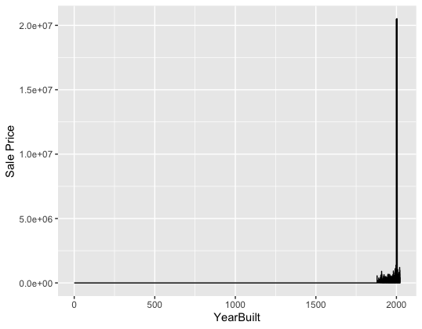
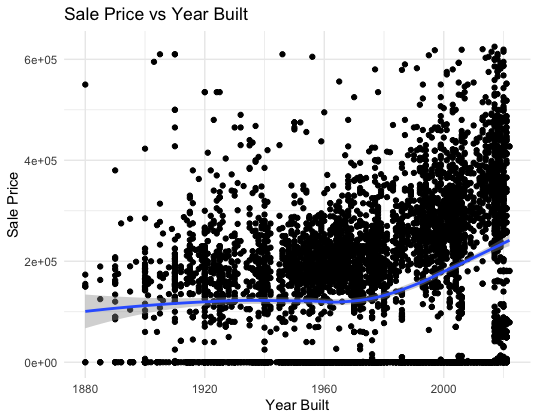
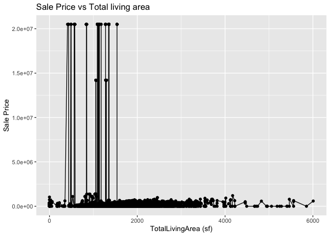

<!-- README.md is generated from README.Rmd. Please edit the README.Rmd file -->

# Lab report \#1

## Owen Kim

### Data Exploration

Inspecting relationships between year built and sale price<br>

1.  There are various variables related to housing, like

- Sale Price
- Total Living Area
- Year Built
- Neighborhood
- Bedrooms
- Lot Area

2.  I will be inspecting relationships between year built and sale
    price.

3 & 4.

    > range(ames$YearBuilt, na.rm = TRUE)
    [1]    0 2022 # there is a dirty data with YearBuilt = 0 messing up the range

<br>

    > range(ames$`Sale Price`, na.rm = TRUE)
    [1]        0 20500000 # also a dirty data

<br>

    #plot line chart
    ggplot(ames, aes(x = `YearBuilt`, y = `Sale Price`)) +
      geom_line()



    # clean x and plot again
    ames_clean <- ames %>%
      filter(`YearBuilt` >= 1880, !is.na(`YearBuilt`), !is.na(`Sale Price`))

    ggplot(ames_clean, aes(x = `YearBuilt`, y = `Sale Price`)) +
       geom_point() +
       geom_smooth(method = "loess") +
       labs(title = "Sale Price vs Year Built",
            x = "Year Built",
            y = "Sale Price")


    # remove y outliers and plot again
    Q1 <- quantile(ames_clean$`Sale Price`, 0.25)
    Q3 <- quantile(ames_clean$`Sale Price`, 0.75)
    IQR <- Q3 - Q1

    ames_clean <- ames_clean %>%
      filter(`Sale Price` > (Q1 - 1.5 * IQR) & `Sale Price` < (Q3 + 1.5 * IQR))
      
    ggplot(ames_clean, aes(x = `YearBuilt`, y = `Sale Price`)) +
       geom_point() +
       geom_smooth(method = "loess") +
       labs(title = "Sale Price vs Year Built",
            x = "Year Built",
            y = "Sale Price")

 <br> Fair to conclude
that house price increased over time, and newly built houses are worth
more, house price started increasing more rapidly starting 1980.

## Bach Nguyen

### Data Exploration

1.  This dataset appears to include property transaction details,
    specifically focusing on sales of real estate in Ames. Here’s a
    breakdown of the variables, their likely types, and what they might
    mean:

Parcel ID: Categorical (likely a string or integer). Unique identifier
for each property parcel.

Address: String. The physical address of the property. Style:
Categorical (string). Describes the architectural style of the building
(e.g., “1 Story Frame,” “Split Level Frame”).

Occupancy: Categorical (string). Describes the occupancy type, such as
“Single-Family / Owner Occupied,” “Condominium,” “Townhouse,” etc.

Sale Date: Date. The date when the property was sold (format:
YYYY-MM-DD).

Sale Price: Numeric. The price the property was sold for. Some entries
have a value of 0, likely indicating no sale or special circumstances.

Multi Sale: Categorical (string, could also be Boolean). Indicates
whether the sale was part of a multi-sale transaction (could be “Yes” or
“NA”).

Year Built: Integer. The year the property was built.

Acres: Numeric. The size of the property in acres.

Total Living Area (sf): Numeric. The total square footage of the living
area.

Bedrooms: Integer. The number of bedrooms in the property.

FinishedBsmtArea (sf): Numeric. The square footage of the finished
basement area, if applicable.

LotArea (sf): Numeric. The total area of the lot in square feet.

AC: Boolean or Categorical (string). Indicates whether the property has
air conditioning (Yes/No).

FirePlace: Boolean or Categorical (string). Indicates whether the
property has a fireplace (Yes/No).

Neighborhood: Categorical (string). The name or code of the neighborhood
where the property is located.

Expected Data Ranges:

Parcel ID: Likely unique alphanumeric values.

Address: Varies based on location, always string values.

Style: Fixed set of categories describing building types. Occupancy:
Limited to a fixed set of categories (e.g., Single-Family, Townhouse).

Sale Date: Should follow a standard date format, possibly ranging across
multiple years.

Sale Price: Varies from 0 to several hundred thousand or millions
depending on property.

Year Built: Typically ranges from the 1800s to recent years.

Acres: Likely to range from small plots (\<0.1) to several acres.

Total Living Area: Typically ranges from a few hundred square feet to
several thousand.

Bedrooms: Likely ranges from 1 to 5 or more.

Finished Basement Area: Can range from 0 to several thousand square
feet.

Lot Area: Ranges from a few thousand square feet to tens of thousands.

AC: Yes/No (string or Boolean).

FirePlace: Yes/No (string or Boolean).

Neighborhood: Limited set of neighborhood codes or names.

2.  I am interested in bedrooms vs sale price.

    3, 4.

    ``` r
    range(classdata::ames$`TotalLivingArea (sf)`, na.rm = TRUE)
    ```

        ## [1]    0 6007

``` r
range(classdata::ames$`Sale Price`, na.rm = TRUE)
```

    ## [1]        0 20500000

``` r
library(ggplot2)
ggplot(classdata::ames, aes(x = `TotalLivingArea (sf)`, y = `Sale Price`)) +
   geom_point() +
  geom_line() +
   labs(title = "Sale Price vs Total living area",
        x = "TotalLivingArea (sf)",
        y = "Sale Price")
```

    ## Warning: Removed 447 rows containing missing values or values outside the scale range
    ## (`geom_point()`).

    ## Warning: Removed 447 rows containing missing values or values outside the scale range
    ## (`geom_line()`).

<!-- -->

From the plot of Sale Price vs Total Living Area (sf), we see a clear
pattern where most sale prices remain clustered at the lower range,
despite varying total living areas. There’s an odd concentration of
extremely high sale prices around the same living area, possibly
indicating erroneous or outlier data. It would be useful to investigate
these high-priced outliers further to confirm their validity, as they
deviate sharply from the rest of the dataset.

This dataset would allow for various analyses of real estate
transactions and property characteristics across Ames.

Follow the instructions posted at
<https://ds202-at-isu.github.io/labs.html> for the lab assignment. The
work is meant to be finished during the lab time, but you have time
until Monday evening to polish things.

Include your answers in this document (Rmd file). Make sure that it
knits properly (into the md file). Upload both the Rmd and the md file
to your repository.

All submissions to the github repo will be automatically uploaded for
grading once the due date is passed. Submit a link to your repository on
Canvas (only one submission per team) to signal to the instructors that
you are done with your submission.
