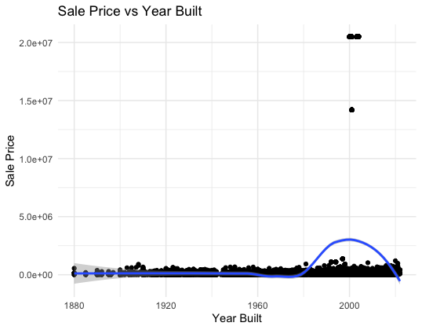
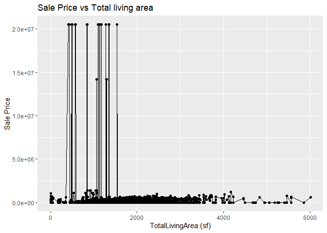
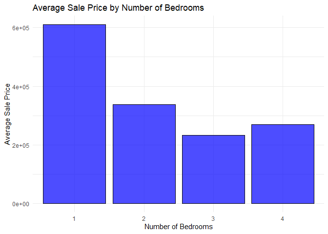

<!-- README.md is generated from README.Rmd. Please edit the README.Rmd file -->

# Lab report \#1

## Owen Kim

### Data Exploration

Inspecting relationships between year built and sale price<br>

1.  There are various variables related to housing, like

- Sale Price
- Total Living Area
- Year Built
- Neighborhood
- Bedrooms
- Lot Area

2.  I will be inspecting relationships between year built and sale
    price.

3 & 4.

    > range(ames$YearBuilt, na.rm = TRUE)
    [1]    0 2022 # there is a dirty data with YearBuilt = 0 messing up the range

<br>

    > range(ames$`Sale Price`, na.rm = TRUE)
    [1]        0 20500000 # also a dirty data

<br>

    #plot line chart
    ggplot(ames, aes(x = `YearBuilt`, y = `Sale Price`)) +
      geom_line()


    # clean x and plot again
    ames_clean <- ames %>%
      filter(`YearBuilt` >= 1880, !is.na(`YearBuilt`), !is.na(`Sale Price`))

    ggplot(ames_clean, aes(x = `YearBuilt`, y = `Sale Price`)) +
       geom_point() +
       geom_smooth(method = "loess") +
       labs(title = "Sale Price vs Year Built",
            x = "Year Built",
            y = "Sale Price")



    # remove y outliers and plot again
    Q1 <- quantile(ames_clean$`Sale Price`, 0.25)
    Q3 <- quantile(ames_clean$`Sale Price`, 0.75)
    IQR <- Q3 - Q1

    ames_clean <- ames_clean %>%
      filter(`Sale Price` > (Q1 - 1.5 * IQR) & `Sale Price` < (Q3 + 1.5 * IQR))
      
    ggplot(ames_clean, aes(x = `YearBuilt`, y = `Sale Price`)) +
       geom_point() +
       geom_smooth(method = "loess") +
       labs(title = "Sale Price vs Year Built",
            x = "Year Built",
            y = "Sale Price")

 <br> Fair to conclude
that house price increased over time, and newly built houses are worth
more, house price started increasing more rapidly starting 1980.

## Bach Nguyen

### Data Exploration

1.  This dataset appears to include property transaction details,
    specifically focusing on sales of real estate in Ames.

Parcel ID: Categorical (likely a string or integer). Unique identifier
for each property parcel.

Address: String. The physical address of the property. Style:
Categorical (string). Describes the architectural style of the building
(e.g., “1 Story Frame,” “Split Level Frame”).

Occupancy: Categorical (string). Describes the occupancy type, such as
“Single-Family / Owner Occupied,” “Condominium,” “Townhouse,” etc.

Sale Date: Date. The date when the property was sold (format:
YYYY-MM-DD).

Sale Price: Numeric. The price the property was sold for. Some entries
have a value of 0, likely indicating no sale or special circumstances.

Multi Sale: Categorical (string, could also be Boolean). Indicates
whether the sale was part of a multi-sale transaction (could be “Yes” or
“NA”).

Year Built: Integer. The year the property was built.

Acres: Numeric. The size of the property in acres.

Total Living Area (sf): Numeric. The total square footage of the living
area.

Bedrooms: Integer. The number of bedrooms in the property.

FinishedBsmtArea (sf): Numeric. The square footage of the finished
basement area, if applicable.

LotArea (sf): Numeric. The total area of the lot in square feet.

AC: Boolean or Categorical (string). Indicates whether the property has
air conditioning (Yes/No).

FirePlace: Boolean or Categorical (string). Indicates whether the
property has a fireplace (Yes/No).

Neighborhood: Categorical (string). The name or code of the neighborhood
where the property is located.

Expected Data Ranges:

Parcel ID: Likely unique alphanumeric values.

Address: Varies based on location, always string values.

Style: Fixed set of categories describing building types. Occupancy:
Limited to a fixed set of categories (e.g., Single-Family, Townhouse).

Sale Date: Should follow a standard date format, possibly ranging across
multiple years.

Sale Price: Varies from 0 to several hundred thousand or millions
depending on property.

Year Built: Typically ranges from the 1800s to recent years.

Acres: Likely to range from small plots (\<0.1) to several acres.

Total Living Area: Typically ranges from a few hundred square feet to
several thousand.

Bedrooms: Likely ranges from 1 to 5 or more.

Finished Basement Area: Can range from 0 to several thousand square
feet.

Lot Area: Ranges from a few thousand square feet to tens of thousands.

AC: Yes/No (string or Boolean).

FirePlace: Yes/No (string or Boolean).

Neighborhood: Limited set of neighborhood codes or names.

2.  I am interested in total living area vs sale price.

    3, 4.

    ``` r
    range(classdata::ames$`TotalLivingArea (sf)`, na.rm = TRUE)
    ```

        ## [1]    0 6007

``` r
range(classdata::ames$`Sale Price`, na.rm = TRUE)
```

    ## [1]        0 20500000

``` r
library(ggplot2)
ggplot(classdata::ames, aes(x = `TotalLivingArea (sf)`, y = `Sale Price`)) +
   geom_point() +
  geom_line() +
   labs(title = "Sale Price vs Total living area",
        x = "TotalLivingArea (sf)",
        y = "Sale Price")
```

    ## Warning: Removed 447 rows containing missing values or values outside the scale range
    ## (`geom_point()`).

    ## Warning: Removed 447 rows containing missing values or values outside the scale range
    ## (`geom_line()`).

<!-- -->

From the plot of Sale Price vs Total Living Area (sf), we see a clear
pattern where most sale prices remain clustered at the lower range,
despite varying total living areas. There’s an odd concentration of
extremely high sale prices around the same living area, possibly
indicating erroneous or outlier data. It would be useful to investigate
these high-priced outliers further to confirm their validity, as they
deviate sharply from the rest of the dataset.

## Nhat Le

1.  Therefore, 6935 records with 16 variables. For example:

- Sale Price
- Year Built
- Arcres -Total Living Area
- Bedriins
- LotArea

The data types of the variable can be seen by running the below code
“str(ames)”

``` r
ames <- classdata::ames
str(ames)
```

    ## tibble [6,935 × 16] (S3: tbl_df/tbl/data.frame)
    ##  $ Parcel ID            : chr [1:6935] "0903202160" "0907428215" "0909428070" "0923203160" ...
    ##  $ Address              : chr [1:6935] "1024 RIDGEWOOD AVE, AMES" "4503 TWAIN CIR UNIT 105, AMES" "2030 MCCARTHY RD, AMES" "3404 EMERALD DR, AMES" ...
    ##  $ Style                : Factor w/ 12 levels "1 1/2 Story Brick",..: 2 5 5 5 NA 9 5 5 5 5 ...
    ##  $ Occupancy            : Factor w/ 5 levels "Condominium",..: 2 1 2 3 NA 2 2 1 2 2 ...
    ##  $ Sale Date            : Date[1:6935], format: "2022-08-12" "2022-08-04" ...
    ##  $ Sale Price           : num [1:6935] 181900 127100 0 245000 449664 ...
    ##  $ Multi Sale           : chr [1:6935] NA NA NA NA ...
    ##  $ YearBuilt            : num [1:6935] 1940 2006 1951 1997 NA ...
    ##  $ Acres                : num [1:6935] 0.109 0.027 0.321 0.103 0.287 0.494 0.172 0.023 0.285 0.172 ...
    ##  $ TotalLivingArea (sf) : num [1:6935] 1030 771 1456 1289 NA ...
    ##  $ Bedrooms             : num [1:6935] 2 1 3 4 NA 4 5 1 3 4 ...
    ##  $ FinishedBsmtArea (sf): num [1:6935] NA NA 1261 890 NA ...
    ##  $ LotArea(sf)          : num [1:6935] 4740 1181 14000 4500 12493 ...
    ##  $ AC                   : chr [1:6935] "Yes" "Yes" "Yes" "Yes" ...
    ##  $ FirePlace            : chr [1:6935] "Yes" "No" "No" "No" ...
    ##  $ Neighborhood         : Factor w/ 42 levels "(0) None","(13) Apts: Campus",..: 15 40 19 18 6 24 14 40 13 23 ...

We can see the means and other statistical summaries by running
summary(ames)

``` r
summary(ames)
```

    ##   Parcel ID           Address                        Style     
    ##  Length:6935        Length:6935        1 Story Frame    :3732  
    ##  Class :character   Class :character   2 Story Frame    :1456  
    ##  Mode  :character   Mode  :character   1 1/2 Story Frame: 711  
    ##                                        Split Level Frame: 215  
    ##                                        Split Foyer Frame: 156  
    ##                                        (Other)          : 218  
    ##                                        NA's             : 447  
    ##                           Occupancy      Sale Date            Sale Price      
    ##  Condominium                   : 711   Min.   :2017-07-03   Min.   :       0  
    ##  Single-Family / Owner Occupied:4711   1st Qu.:2019-03-27   1st Qu.:       0  
    ##  Townhouse                     : 745   Median :2020-09-22   Median :  170900  
    ##  Two-Family Conversion         : 139   Mean   :2020-06-14   Mean   : 1017479  
    ##  Two-Family Duplex             : 182   3rd Qu.:2021-10-14   3rd Qu.:  280000  
    ##  NA's                          : 447   Max.   :2022-08-31   Max.   :20500000  
    ##                                                                               
    ##   Multi Sale          YearBuilt        Acres         TotalLivingArea (sf)
    ##  Length:6935        Min.   :   0   Min.   : 0.0000   Min.   :   0        
    ##  Class :character   1st Qu.:1956   1st Qu.: 0.1502   1st Qu.:1095        
    ##  Mode  :character   Median :1978   Median : 0.2200   Median :1460        
    ##                     Mean   :1976   Mean   : 0.2631   Mean   :1507        
    ##                     3rd Qu.:2002   3rd Qu.: 0.2770   3rd Qu.:1792        
    ##                     Max.   :2022   Max.   :12.0120   Max.   :6007        
    ##                     NA's   :447    NA's   :89        NA's   :447         
    ##     Bedrooms      FinishedBsmtArea (sf)  LotArea(sf)          AC           
    ##  Min.   : 0.000   Min.   :  10.0        Min.   :     0   Length:6935       
    ##  1st Qu.: 3.000   1st Qu.: 474.0        1st Qu.:  6553   Class :character  
    ##  Median : 3.000   Median : 727.0        Median :  9575   Mode  :character  
    ##  Mean   : 3.299   Mean   : 776.7        Mean   : 11466                     
    ##  3rd Qu.: 4.000   3rd Qu.:1011.0        3rd Qu.: 12088                     
    ##  Max.   :10.000   Max.   :6496.0        Max.   :523228                     
    ##  NA's   :447      NA's   :2682          NA's   :89                         
    ##   FirePlace                            Neighborhood 
    ##  Length:6935        (27) Res: N Ames         : 854  
    ##  Class :character   (37) Res: College Creek  : 652  
    ##  Mode  :character   (57) Res: Investor Owned : 474  
    ##                     (29) Res: Old Town       : 469  
    ##                     (34) Res: Edwards        : 444  
    ##                     (19) Res: North Ridge Hei: 420  
    ##                     (Other)                  :3622

2.  I will be inspecting the Bedrooms and the Sale Price

3 & 4. Sale price ra ranges from 0 to 20500000; Bedrooms ranges from 0
to 10

``` r
range(ames$`Sale Price`, rm.na = TRUE)
```

    ## [1]        0 20500000

``` r
bedroom_range <- range(ames$Bedrooms, na.rm = TRUE)
print(bedroom_range)
```

    ## [1]  0 10

The bar chart showing the average sale price by the number of bedrooms
indicates how property pricing varies with the number of bedrooms.
Typically, you would expect that more bedrooms could correlate with a
higher average sale price, although the chart suggests there might be
nuances in this relationship.

Review the bar chart for any apparent trends. For example, if properties
with one bedroom have significantly higher average sale prices than
those with two or three, this might indicate a specific market demand or
limited availability of one-bedroom properties.

Look for outliers or unusual data points. If certain bedroom counts have
much higher or lower prices than expected, investigate these cases
further. For instance, if a property with four bedrooms sells for much
less than average, it could be due to other factors like condition,
location, or market anomalies.

``` r
library(dplyr)
```

    ## 
    ## Attaching package: 'dplyr'

    ## The following objects are masked from 'package:stats':
    ## 
    ##     filter, lag

    ## The following objects are masked from 'package:base':
    ## 
    ##     intersect, setdiff, setequal, union

``` r
library(ggplot2)
# Assuming 'ames' is your dataframe
# First, ensure Bedrooms is numeric and remove NA values
ames$Bedrooms <- as.numeric(as.character(ames$Bedrooms))
ames <- na.omit(ames)

# Create a summarized dataframe to calculate the average Sale Price for each number of Bedrooms
average_price <- ames %>%
  group_by(Bedrooms) %>%
  summarize(Average_Sale_Price = mean(`Sale Price`, na.rm = TRUE))

# Create bar chart
ggplot(average_price, aes(x = factor(Bedrooms), y = Average_Sale_Price)) +
  geom_bar(stat = "identity", fill = "blue", color = "black", alpha = 0.7) +
  labs(title = "Average Sale Price by Number of Bedrooms",
       x = "Number of Bedrooms",
       y = "Average Sale Price") +
  theme_minimal()
```

<!-- -->

``` r
# Assuming 'ames' is your dataframe
# First, ensure Bedrooms is numeric and remove NA values
ames$Bedrooms <- as.numeric(as.character(ames$Bedrooms))
ames <- na.omit(ames)

# Perform ANOVA
anova_result <- aov(`Sale Price` ~ factor(Bedrooms), data = ames)
summary(anova_result)
```

    ##                  Df    Sum Sq   Mean Sq F value Pr(>F)
    ## factor(Bedrooms)  3 1.102e+11 3.673e+10   0.324  0.809
    ## Residuals         5 5.674e+11 1.135e+11

``` r
# Visualize ANOVA results with boxplot
ggplot(ames, aes(x = factor(Bedrooms), y = `Sale Price`)) +
  geom_boxplot(fill = "lightblue", color = "black", alpha = 0.7) +
  labs(title = "Boxplot of Sale Price by Number of Bedrooms",
       x = "Number of Bedrooms",
       y = "Sale Price") +
  theme_minimal()
```

<!-- -->

Follow the instructions posted at
<https://ds202-at-isu.github.io/labs.html> for the lab assignment. The
work is meant to be finished during the lab time, but you have time
until Monday evening to polish things.

Include your answers in this document (Rmd file). Make sure that it
knits properly (into the md file). Upload both the Rmd and the md file
to your repository.

All submissions to the github repo will be automatically uploaded for
grading once the due date is passed. Submit a link to your repository on
Canvas (only one submission per team) to signal to the instructors that
you are done with your submission.
